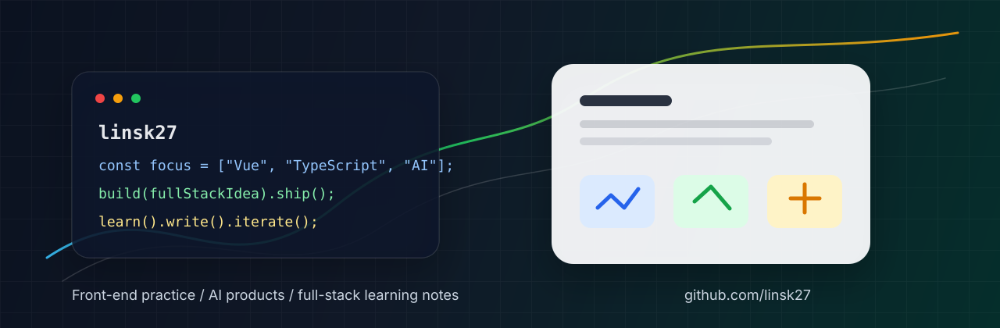
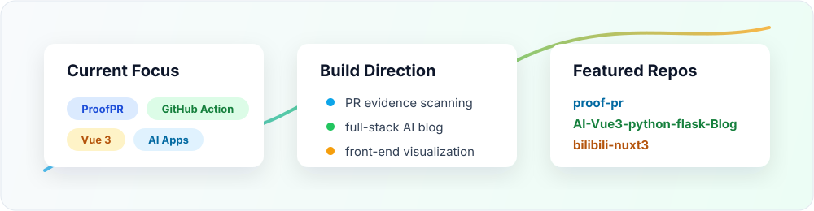

<p align="center">
  
</p>

<h1 align="center">Hi, I'm linsk27</h1>

<p align="center">
  Front-end learner and builder. I work with Vue, TypeScript, Nuxt, Flask, and small AI-powered products.
</p>

<p align="center">
  <a href="https://github.com/linsk27?tab=repositories">
    
  </a>
  <a href="https://linsk27-github-io.vercel.app">
    
  </a>
  <a href="https://github.com/linsk27">
    
  </a>
</p>

---

### About Me

- 我关注前端交互、页面结构、数据可视化，也在补全后端与数据库能力。
- 喜欢把学习过程做成可运行的项目，而不是只停留在笔记里。
- 正在探索 AI 工具如何参与真实开发流程：从原型、组件到完整应用。
- Current stack: Vue 3, TypeScript, Nuxt 3, Flask, MySQL, ECharts, HTML/CSS, JavaScript.

### Tech Stack

<p>
  
  
  
  
  
  
  
  
</p>

### Featured Work

| Project | What it shows | Stack |
| --- | --- | --- |
| [AI-Vue3-python-flask-Blog](https://github.com/linsk27/AI-Vue3-python-flask-Blog) | Vue 3 + Flask + MySQL AI 博客系统，适合课程设计、毕业设计和二次开发。 | Vue, Python, Flask, MySQL |
| [echarts-learn](https://github.com/linsk27/echarts-learn) | 数据可视化与图表交互练习。 | Vue, ECharts |
| [Vue-blog](https://github.com/linsk27/Vue-blog) | 用博客项目整理前端学习与内容展示。 | Vue |
| [bilibili-nuxt3](https://github.com/linsk27/bilibili-nuxt3) | Nuxt 3 与 TypeScript 应用结构练习。 | TypeScript, Nuxt 3 |
| [linsk27.github.io](https://github.com/linsk27/linsk27.github.io) | 个人站点与博客部署。 | HTML, Vercel |

### GitHub Snapshot

<p align="center">
  
</p>

### Focus Right Now

```txt
Vue 3 / TypeScript        组件、交互、工程结构
Nuxt 3                    现代前端应用实践
Flask / MySQL             后端接口与数据持久化
AI tools                  原型设计与开发效率提升
```

### Contact

<p>
  <a href="https://github.com/linsk27">
    
  </a>
  
</p>

You can reach me on WeChat: `linsk27`.

---

<p align="center">
  Thanks for visiting. You can check out my repositories and blog above.
</p>
