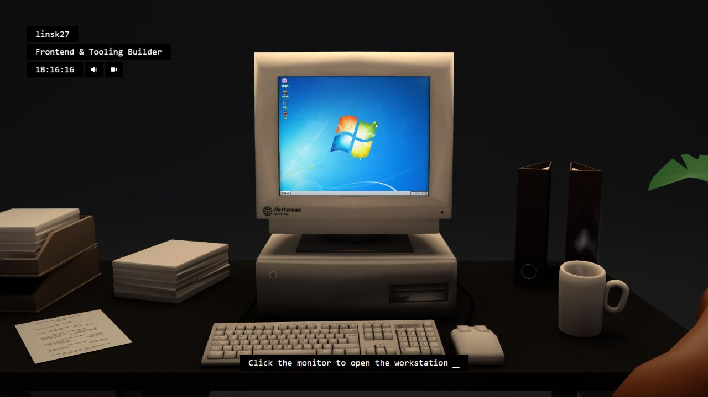

# 你好，我是 linsk27

我主要做前端应用、开发者工具和数据可视化，常用 Vue、TypeScript、React、Python 与 Three.js。相比堆叠功能，我更在意项目是否清晰、可运行，并且能持续迭代。

Frontend developer focused on useful tools and polished product experiences.

[技术博客](https://linsk27.github.io/) / [项目索引](https://linsk27.github.io/projects/) / [开源实验室](https://github.com/linsk-labs)

## 精选项目

- **[Dev Cockpit](https://github.com/linsk-labs/local-dev-cockpit)**：本地开发工作台，集中管理项目、启动命令、端口、日志与 Git 状态。
- **[Local AI Ops](https://github.com/linsk-labs/local-ai-ops)**：面向局域网环境的云资源与运维工作台，覆盖监控、告警和排查流程。
- **[ProofPR](https://github.com/linsk-labs/proof-pr)**：面向维护者的 PR 证据检查器，支持命令行与 GitHub Actions。
- **[Signal Atlas](https://github.com/linsk-labs/signal-atlas)**：使用 Three.js、CSS3D 与 Vue 构建的交互式项目图谱。[在线体验](https://linsk27.dpdns.org/)

## 项目分区

- **[linsk-labs](https://github.com/linsk-labs)**：开发者工具、本地应用与交互实验。
- **[个人作品](https://github.com/linsk27?tab=repositories&q=&type=source)**：全栈应用、Vue 项目与数据可视化作品。
- **[技术笔记](https://linsk27.github.io/archives/)**：项目复盘、前端基础与工程实践。

## Signal Atlas / Reference Edition

[在线体验](https://linsk27.dpdns.org/) / [项目短片](./assets/showcase/linsk27-projects-showcase.mp4)

## 联系

GitHub [@linsk27](https://github.com/linsk27) / 微信 `linsk27`
