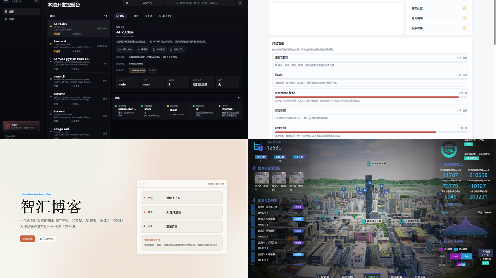

  

<h1 align="center">linsk27</h1>

  前端应用 · 开发者工具 · 数据可视化 · 全栈实践

  <a href="#zh">简体中文</a>
  ·
  <a href="#english">English</a>
  ·
  <a href="https://linsk27.github.io/">Blog</a>
  ·
  <a href="https://linsk27.github.io/projects/">Portfolio</a>
  ·
  <a href="https://github.com/linsk27?tab=repositories">Projects</a>

  
  
  
  
  

## 中文

我主要做前端应用、开发者工具、数据可视化和本地优先的全栈项目。比起只写 demo，我更关注一个项目能不能被真正跑起来、看明白、继续迭代：界面结构、状态流、接口、部署、文档和展示结果都要闭环。

这里保留我当前更希望被看到的项目。每个重点项目都会尽量提供 README、截图、运行入口和博客说明，让访问者快速判断它是什么、为什么做、怎么运行。

## Start here

- 项目主页：[linsk27.github.io/projects](https://linsk27.github.io/projects/)
- GitHub 项目索引：[linsk27.github.io/github](https://linsk27.github.io/github/)
- 技术笔记：[linsk27.github.io](https://linsk27.github.io/)

## 项目短片

[查看 MP4 项目短片](./assets/showcase/linsk27-projects-showcase.mp4)

## 代表项目

| 项目 | 简介 | 技术栈 | 链接 |
| --- | --- | --- | --- |
| Local AI Ops | 局域网本地阿里云运维工作台，整理云资源、监控检查、告警闭环和排查建议。 | FastAPI, React, PostgreSQL | [Repo](https://github.com/linsk27/local-ai-ops) / [Article](https://linsk27.github.io/projects/local-ai-ops/) |
| Dev Cockpit | 本地开发工作台，恢复项目状态、启动命令、端口日志、Git 状态和开发上下文。 | React, TypeScript, Node.js | [Repo](https://github.com/linsk27/local-dev-cockpit) / [Article](https://linsk27.github.io/projects/dev-cockpit/) |
| ProofPR | PR 证据检查器，把测试、依赖、权限、密钥和审查风险整理成维护者报告。 | TypeScript, GitHub Actions | [Repo](https://github.com/linsk27/proof-pr) / [Article](https://linsk27.github.io/projects/proofpr/) |
| feidu | 智慧社区数据大屏，覆盖安防监控、CIM 平台、能源数据和可视化看板。 | Nuxt, Vue, ECharts | [Repo](https://github.com/linsk27/feidu) / [Demo](https://feidu-murex.vercel.app) |
| AI Vue Flask Blog | Vue 3、Flask、MySQL 全栈博客系统，覆盖前后端接口、内容管理和页面展示。 | Vue, Flask, MySQL | [Repo](https://github.com/linsk27/AI-Vue3-python-flask-Blog) / [Article](https://linsk27.github.io/projects/ai-vue-flask-blog/) |

## 关注方向

| 方向 | 我在做什么 |
| --- | --- |
| 前端工程 | Vue、Nuxt、React、TypeScript 项目结构和可维护界面。 |
| 开发者工具 | 本地开发工作流、项目状态恢复、CLI 和桌面工具。 |
| 自动化与证据 | GitHub Actions、PR review 报告、风险信号整理。 |
| 数据可视化 | ECharts 大屏、业务看板、社区和能源数据展示。 |
| 全栈实践 | FastAPI、Flask、MySQL、PostgreSQL、接口设计、部署和项目文档。 |

## 项目原则

- 可运行：README 里给出明确入口和本地启动路径。
- 可判断：项目说明先讲解决什么问题，再讲技术栈。
- 可展示：重点项目保留截图、模拟图或可访问演示。
- 可维护：文档里写清边界，不把实验项目包装成生产系统。

## 联系

- GitHub: [@linsk27](https://github.com/linsk27)
- Blog: [linsk27.github.io](https://linsk27.github.io/)
- WeChat: `linsk27`

## English

I build frontend applications, developer tools, data dashboards, and local-first full-stack projects. I care about projects that are runnable, understandable, and easy to continue: clean UI structure, state flow, APIs, deployment notes, documentation, and visible product outcomes.

Selected work includes Local AI Ops, Dev Cockpit, ProofPR, feidu, and several Vue / Nuxt / Flask projects. Most repositories include screenshots, project notes, and a clear path for running or reviewing the result.

For collaboration or quick contact, reach me on GitHub or WeChat: `linsk27`.
