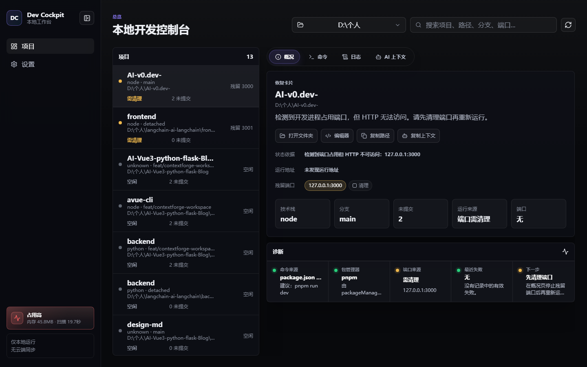
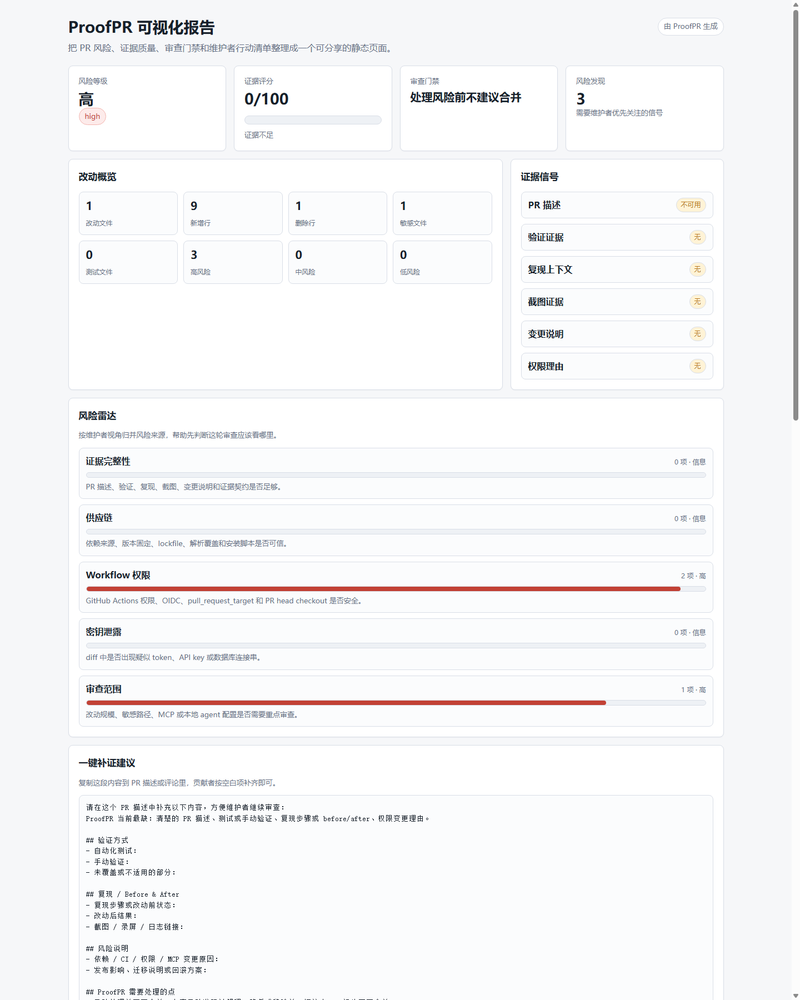
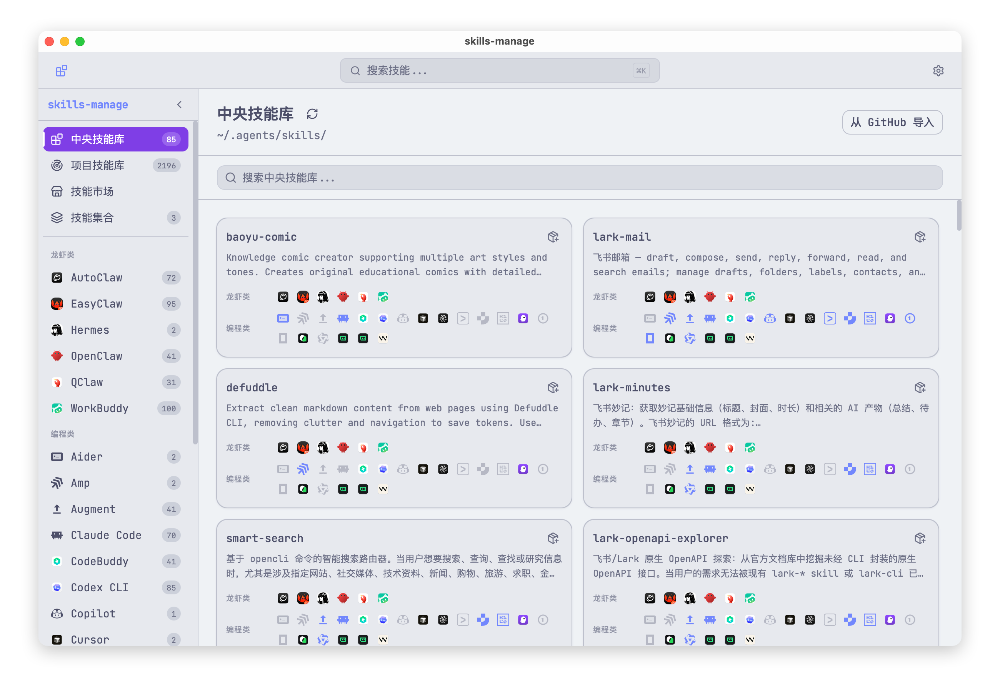
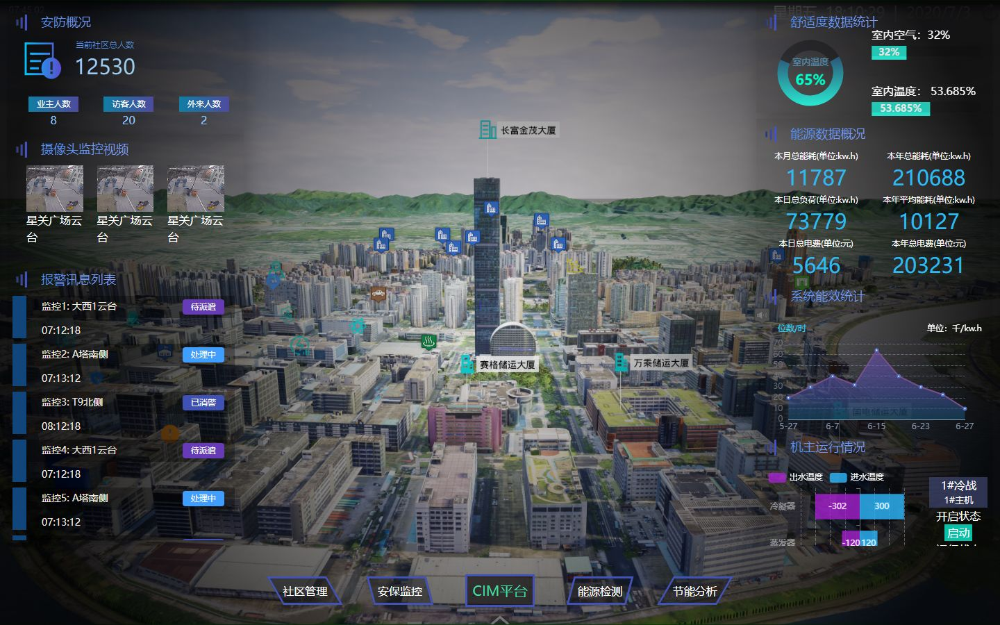
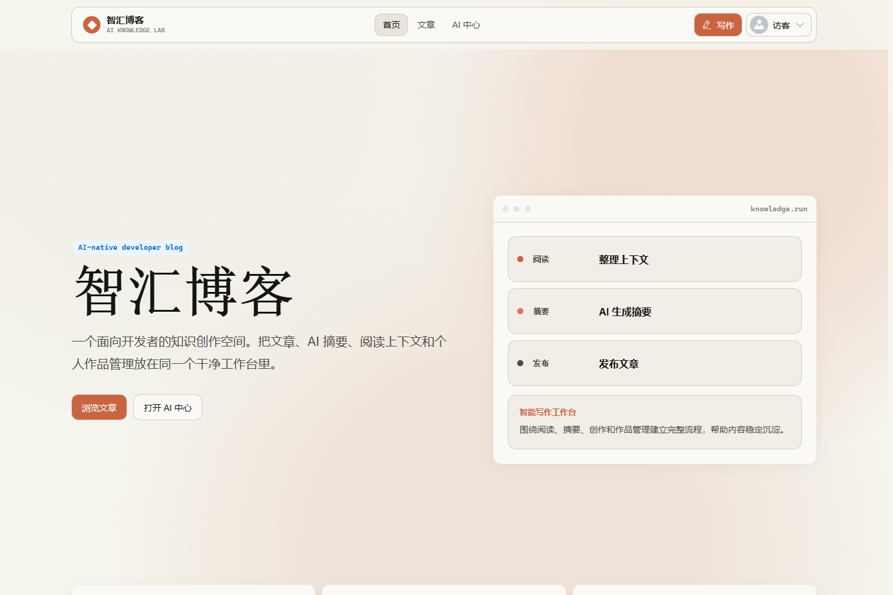
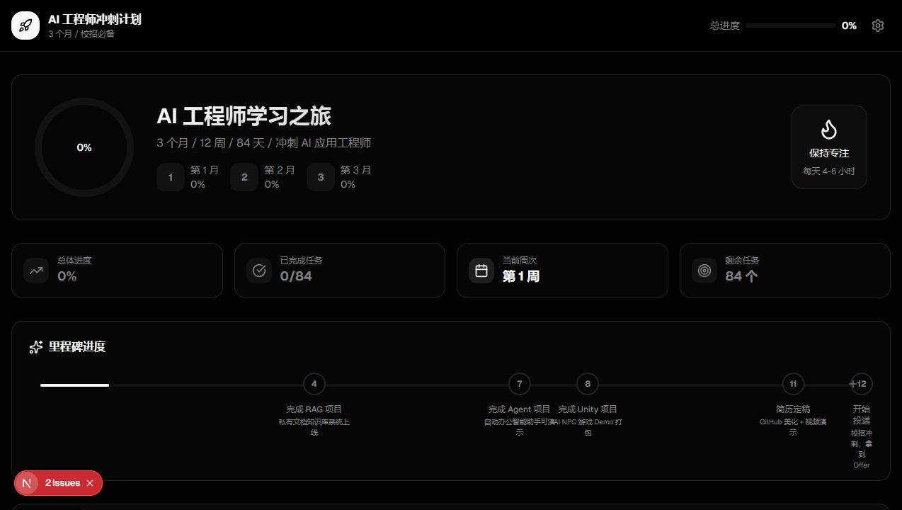

  

<h1 align="center">linsk27</h1>

  我主要做本地开发工具、AI 编程工作流、agent skills 管理、数据大屏，以及 Vue / Nuxt 全栈项目实践。

  <a href="https://linsk27-github-io.vercel.app/projects/">项目主页</a>
  &nbsp;&nbsp;
  <a href="https://linsk27-github-io.vercel.app/about/">关于我</a>
  &nbsp;&nbsp;
  <a href="https://linsk27-github-io.vercel.app/github/">GitHub 项目</a>
  &nbsp;&nbsp;
  <a href="https://linsk27-github-io.vercel.app/projects/skills-manage/">skills-manage</a>
  &nbsp;&nbsp;
  <a href="https://linsk27-github-io.vercel.app/projects/feidu/">feidu</a>
  &nbsp;&nbsp;
  <a href="https://linsk27-github-io.vercel.app/projects/dev-cockpit/">Dev Cockpit</a>
  &nbsp;&nbsp;
  <a href="https://linsk27-github-io.vercel.app">博客</a>
  &nbsp;&nbsp;
  <a href="https://linsk27-github-io.vercel.app/projects/proofpr/">ProofPR</a>

### 关于我

我喜欢把一个想法做成真正可运行、可验证、可交付的项目。现在主要关注本地开发工作流、AI 辅助开发、前端应用结构、数据可视化大屏，以及全栈产品从界面到数据流的完整体验。

最近在做 [Dev Cockpit](https://github.com/linsk27/local-dev-cockpit) 和 [ProofPR](https://github.com/linsk27/proof-pr)。前者用于恢复本地项目现场，后者用于整理 Pull Request 里的证据信号。两者都围绕同一个目标：减少重复判断，让开发者更快回到真正需要处理的问题上。

更多介绍：[关于 linsk27](https://linsk27-github-io.vercel.app/about/)

### 代表项目

**[Dev Cockpit](https://github.com/linsk27/local-dev-cockpit)**  
本地开发工作台，用来集中查看项目状态、启动命令、日志、端口、Git 状态和 AI 上下文。

  

**[ProofPR](https://github.com/linsk27/proof-pr)**  
面向开源维护者的 PR 证据检查器，也可以作为 GitHub Action 接入仓库，用于整理 review 风险、敏感信息、依赖、CI 权限和 MCP 安全信号。

  

**[skills-manage](https://linsk27-github-io.vercel.app/projects/skills-manage/)**  
Tauri 桌面应用，用来管理 Claude Code、Codex CLI、Cursor、Gemini CLI 等 20 多个平台的 AI coding agent skills。

[仓库](https://github.com/linsk27/skills-manage)

  

**[feidu](https://linsk27-github-io.vercel.app/projects/feidu/)**  
Nuxt 3、Vue、Tailwind CSS 和 ECharts 智慧社区数据大屏，覆盖安防监控、CIM 平台、能源监测和数据可视化。

[仓库](https://github.com/linsk27/feidu) / [演示](https://feidu-murex.vercel.app)

  

**[AI-Vue3-python-flask-Blog](https://linsk27-github-io.vercel.app/projects/ai-vue-flask-blog/)**  
Vue 3、Flask、MySQL 和 AI 博客系统，适合作为全栈项目实践、课程设计、毕业设计和二次开发参考。

[仓库](https://github.com/linsk27/AI-Vue3-python-flask-Blog)

  

**[AI-v0.dev-](https://linsk27-github-io.vercel.app/projects/ai-v0-dev/)**  
Next.js 和 TypeScript 原型项目，用来探索 AI 学习看板、v0.dev 风格 UI、项目卡片和进度追踪体验。

[仓库](https://github.com/linsk27/AI-v0.dev-)

  

### 项目列表

**[Dev Cockpit](https://linsk27-github-io.vercel.app/projects/dev-cockpit/)**  
本地开发工作台，用来集中查看项目、启动命令、日志、端口、Git 状态和 AI 上下文。它关注的是个人开发中的现场恢复：知道项目怎么跑、哪里在线、上次失败在哪里，以及如何把背景快速交给 AI coding agent。

[仓库](https://github.com/linsk27/local-dev-cockpit)

**[ProofPR](https://linsk27-github-io.vercel.app/projects/proofpr/)**  
面向开源维护者的 PR 证据检查器，也是可以接入仓库的 GitHub Action。它把 Pull Request 中容易被忽略的风险信号整理成报告，让 review 更有依据。

[仓库](https://github.com/linsk27/proof-pr)

**[skills-manage](https://linsk27-github-io.vercel.app/projects/skills-manage/)**  
AI coding agent skills 管理桌面应用，用来把 Claude Code、Codex CLI、Cursor、Gemini CLI 等 20 多个平台的 skills 集中管理、搜索、导入和安装。

[仓库](https://github.com/linsk27/skills-manage)

**[feidu](https://linsk27-github-io.vercel.app/projects/feidu/)**  
Nuxt 3、Vue、Tailwind CSS 和 ECharts 智慧社区数据大屏，覆盖社区管理、安防监控、CIM 平台、能源检测和节能分析。适合参考数据大屏、智慧园区、安防运维和能源看板类前端实现。

[仓库](https://github.com/linsk27/feidu) / [演示](https://feidu-murex.vercel.app)

**[AI-Vue3-python-flask-Blog](https://linsk27-github-io.vercel.app/projects/ai-vue-flask-blog/)**  
Vue 3、Flask 和 MySQL 组成的 AI 博客系统，覆盖前端页面、后端接口、数据持久化和内容管理，适合作为完整全栈项目继续扩展。

**[AI-v0.dev-](https://linsk27-github-io.vercel.app/projects/ai-v0-dev/)**  
围绕 AI 界面和产品原型的 TypeScript 实践，用来探索更快的前端构建方式和更自然的交互表达。

**[Vue-blog](https://linsk27-github-io.vercel.app/projects/vue-blog/)**  
Vue 博客前端项目，包含文章入口、AI 中心和数据分析看板等页面结构。线上演示：[vue-blog-smoky.vercel.app](https://vue-blog-smoky.vercel.app/)。

[仓库](https://github.com/linsk27/Vue-blog)

**[echarts-learn](https://linsk27-github-io.vercel.app/projects/echarts-learn/)**  
Vue、Nuxt 和 ECharts 数据可视化练习，展示 dashboard 布局、柱状图、雷达图、关系图、环形图和词云等页面组合。

[仓库](https://github.com/linsk27/echarts-learn)

**[bilibili-nuxt3](https://linsk27-github-io.vercel.app/projects/bilibili-nuxt3/)**  
Nuxt 3、Vue、TypeScript 和 Vant 移动端项目实战，展示 SSR、SEO、频道导航、视频列表和详情页结构。

[仓库](https://github.com/linsk27/bilibili-nuxt3)

### 技术栈

Vue 3, React, TypeScript, JavaScript, Nuxt 3, Node.js, Vite, Electron, Tauri, GitHub Actions, Python, Flask, MySQL, ECharts, Tailwind CSS.

### 关注方向

我关注本地开发工作台、开发者效率工具、AI coding assistants、agent skills 管理、Pull Request 自动化 review、GitHub Actions、TypeScript CLI、Vue 3 应用、Nuxt 前端、Flask API、MySQL 系统、智慧社区大屏和数据可视化。

### 最近在做

- 打磨 Dev Cockpit 的本地项目扫描、状态恢复和 AI 上下文体验。
- 继续完善 ProofPR 的检测规则、报告质量和维护者工作流。
- 继续完善 AI 博客系统的产品完整度。

### 联系与 Star

项目问题欢迎在对应仓库提交 issue。  
合作或快速联系可以加微信：linsk27。

如果这些项目对你有帮助，给对应仓库点一个 Star 是最直接的反馈，也能让我判断下一步应该优先完善哪个方向。
